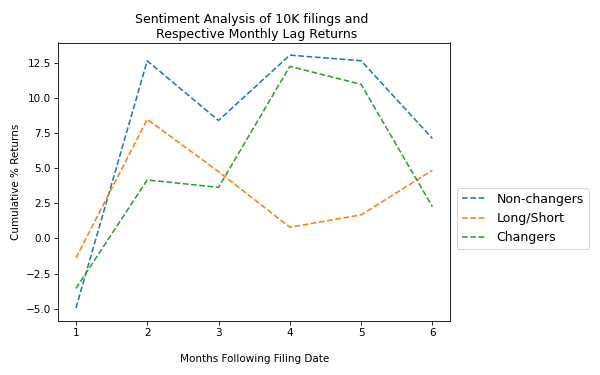

# Alpha Generation and NLP Analysis in the Equity Markets
Applying NLP framework to study intrinsic risk associated with 10K filings risk disclosures from S&amp;P500 companies. 

In each 10K annual filing, companies include information about the most significant risks that apply to the company and to its securities. Firms are mandated by the SEC to report information such as “Risk Factors” in their 10-K and detailed insection Item 1A.  Risks highlighted from year to year include both business and market-related nature.  Items found in this section could highlight broader market risk as well as unsystematic risk. 

The included scripts written in python scrape together a dataframe of S&P 500 companies and their respective SEC filing codes and GIC industry sectors.  Each company is then analyzed for the yearly delta in the "negative" term frequency as found in it's annual 10K filings.  The relative change in a firms' “riskiness” of its business and/or industry is calculated as the % change in the negative language(as per financial dictionaries applied from University research settings).

### Overview

* Scraping 10-K filings for equity return alpha and applying an NLP framework to study intrinsic risk associated with volatility in corporate risk disclosures,
* In each 10K annual filing, companies include information about the most significant risks that apply to the company or to its securities.
* Firms are mandated by the SEC to report information such as “Risk Factors” in their 10-K and detailed insection Item 1A. 
* Risks highlighted from year to year include both business and market-related nature.  Items found in this section could highlight broader market risk as well as unsystematic risk.
* The respective financial statements are scrapped for financial terms and analyzed for sentiment.
* The sentiment is placed into a list using a bag of words approach and analyzed screened for "negative" term frequency as found in it's annual 10K filings.
* The respective change in a firms' “riskiness” of its business and/or industry is calculated with TF-IDF (term frequency inverse document frequency) for negative language(as per financial dictionaries applied from University research settings).  The cosine symmetry between each firm's corpus of 10K filing negative terms is calculated for each respective year and sorted for relative risk.
* This analysis utilized research in textual analysis for financial applications and data provided by the Accounting and Finance dept at the University of Notre Dame.  
* In this analysis, I reviewed the S&P 500 companies and sought to uncover unique risk profiles for each company and its respective GICS sector. 
* The end-use is designed to provide alpha application by assessing intrinsic risk, some of which may be underappreciated by the market.  
* In further analysis, I will look to see where this can add value as a factor in pricing options, particularly in comparing implied vols and historic volatility.

### Code and Resources Used
Python Version: 3.7  
Environment: Google Colab, Atom IDE, Jupyter notebook 

Packages: pandas, numpy, statsmodels, sklearn, matplotlib, keras  

### Data Cleaning
* 

### EDA
Below are a few highlights:

### Model Building

### Model Performance

