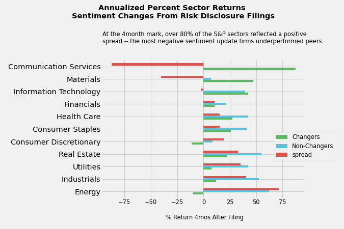
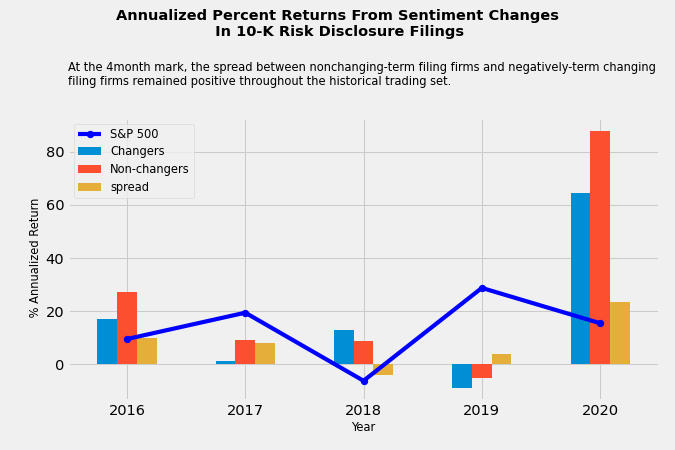

# Alpha Generation and NLP Analysis in the Equity Markets
Applying NLP framework to study intrinsic risk associated with 10K filings and related risk disclosures from S&amp;P500 companies. 

### Overview

* Scraping 10-K filings for equity return alpha and applying an NLP framework to study intrinsic risk associated with volatility in corporate risk disclosures,
* In each 10K annual filing, companies include information about the most significant risks that apply to the company or to its securities.
* Firms are mandated by the SEC to report information such as “Risk Factors” in their 10-K and detailed insection Item 1A. 
* Risks highlighted from year to year include both business and market-related nature.  Items found in this section could highlight broader market risk as well as unsystematic risk.
* The respective financial statements are scrapped for financial terms and analyzed for sentiment.
* The sentiment is placed into a list using a bag of words approach and analyzed screened for "negative" term frequency as found in it's annual 10K filings.
* The respective change in a firms' “riskiness” of its business and/or industry is calculated with TF-IDF (term frequency inverse document frequency) for negative language(as per financial dictionaries applied from University research settings).  The cosine symmetry between each firm's corpus of 10K filing negative terms is calculated for each respective year and sorted for relative risk.
* This analysis utilized research in textual analysis for financial applications and data provided by [Loughran-McDonald lexicon](https://papers.ssrn.com/sol3/papers.cfm?abstract_id=1331573), which assigns a value to words based on the financial services industry context.  
* In this analysis, I reviewed the S&P 500 companies and sought to uncover unique risk profiles for each company and its respective GICS sector. 
* The end-use is designed to provide alpha application by assessing intrinsic risk, some of which may be underappreciated by the market.  
* In further analysis, I will look to see where this can add value as a factor in pricing options, particularly in comparing implied vols and historic volatility.

### Code and Resources Used
Python Version: 3.7  
edgar Version: edgar 5.4.1

Environment: Google Colab, Atom IDE, Jupyter notebook 

Packages: pandas, numpy, statsmodels, sklearn, matplotlib, NLTK, spaCy, beautifulsoup, edgar, yfinance 

### Data Cleaning
* Scraped the wiki with BeautifulSoup for the S&P companies, tickers, CIK identifier and GICS Sector information - [List of S&P 500 companies](https://en.wikipedia.org/wiki/List_of_S%26P_500_companies)
* Read the wiki html table into a pandas dataframe
* Reformat CIK identifier to a readable version for the sec-edgar scrapping module
* Create a dictionary for the company name and respective CIK code in order to correctly iterate through the edgar module parameters.
* Parsed the text scrapped from edgar library and used regex to find sections of the financial statements pertaining to the Risk Factors(1A)
* Returned just the spanned text from section 1A and where files were not formatted correctly or the document version was an ammendment and that section didn't exist, the company was pulled from the dataset.  

### EDA
Below are a few highlights:

### Model Building
* Grouped the dataset by the datapoints per year for each stock
* Tokenized and stemmed each token from the document to find the YoY change with spaCy
* Used TfidfVectorizer and applied a financial dictionary derived using the Loughran-McDonald dictionary.
* Applied cosine similarity on the TDIF vectorized dataset for the yearly comparison for each respective company's parsed 10K filing.

### Model Performance
The cumulative return of the long non-negative changing sentiment firms and short the increased negative sentiment changing firms, the "spread" averaged 13% over the 5-year investment horizon, comparable to the S&P500 and exceeded the relative sharpe ratio as a result of a lower volatility.

